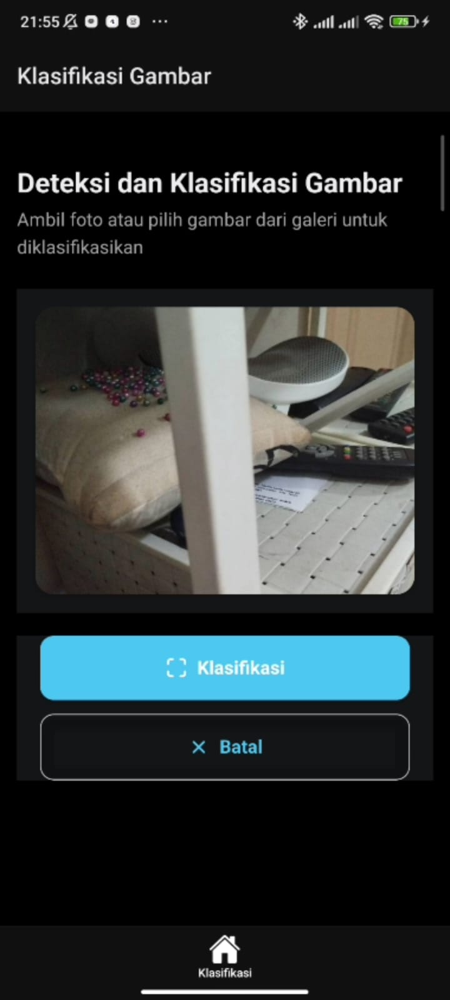
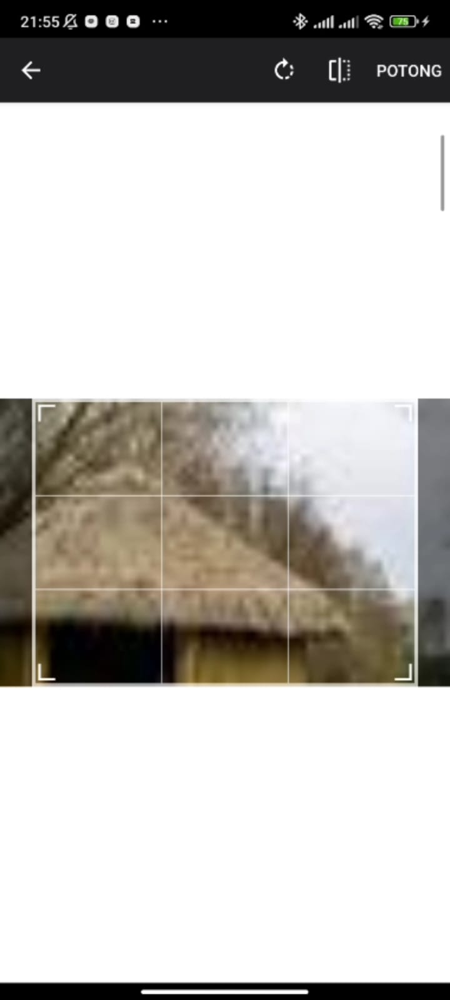

# TileClassify: Sistem Pengenalan dan Klasifikasi Genteng

<p align="center">
  <b>Aplikasi Mobile untuk Klasifikasi Jenis dan Harga Genteng</b><br>
  <i>Kerjasama Mahasiswa dan Dosen Universitas Mercu Buana</i>
</p>

<p align="center">
  <a href="#tentang-projek">Tentang Projek</a> •
  <a href="#fitur-utama">Fitur Utama</a> •
  <a href="#cara-menggunakan">Cara Menggunakan</a> •
  <a href="#instalasi--pengembangan">Instalasi & Pengembangan</a> •
  <a href="#teknologi-yang-digunakan">Teknologi</a> •
  <a href="#kontribusi">Kontribusi</a> •
  <a href="#lisensi">Lisensi</a>
</p>

## Tentang Projek

TileClassify adalah aplikasi mobile yang dikembangkan untuk membantu mengklasifikasikan jenis dan harga genteng melalui gambar. Proyek ini merupakan hasil kerjasama antara mahasiswa dan dosen dalam mengimplementasikan model AI untuk pengenalan genteng.

Aplikasi ini menggunakan teknologi React Native (Expo) untuk frontend mobile dan terhubung dengan backend API yang menggunakan model machine learning untuk klasifikasi, dapat dilihat [di repository backend](https://github.com/anggara-26/tileclassify-backend). Pengguna dapat mengambil foto genteng menggunakan kamera smartphone atau memilih gambar dari galeri, lalu sistem akan mengklasifikasikan jenis genteng beserta perkiraan harganya.

## Fitur Utama

- **Pengambilan Foto Langsung**: Ambil foto genteng langsung menggunakan kamera perangkat
- **Pilihan Gambar dari Galeri**: Pilih gambar genteng dari galeri perangkat
- **Klasifikasi Otomatis**: Mengenali jenis genteng dan estimasi harga
- **Tampilan Hasil dengan Confidence Level**: Lihat hasil klasifikasi dengan tingkat kepercayaan
- **Antarmuka Pengguna Modern**: Desain UI yang intuitif dan mudah digunakan
- **Dukungan Light/Dark Mode**: Tampilan yang nyaman untuk berbagai kondisi cahaya
- **Optimasi Gambar Otomatis**: Proses kompresi dan pengolahan gambar sebelum dikirim ke API

## Demo

<p align="center">
  
  
  
</p>

## Cara Menggunakan

1. Buka aplikasi dan navigasikan ke tab "Klasifikasi"
2. Pilih salah satu metode pengambilan gambar:
   - **Ambil Foto dengan Kamera**: Untuk mengambil gambar genteng secara langsung
   - **Pilih Gambar dari Galeri**: Untuk memilih foto genteng yang sudah ada
3. Tekan tombol "Klasifikasi" untuk memproses gambar
4. Hasil klasifikasi akan ditampilkan berupa:
   - Jenis genteng
   - Perkiraan harga
   - Tingkat kepercayaan analisis

## Instalasi & Pengembangan

### Prasyarat

- Node.js (versi 18 atau yang lebih baru)
- pnpm
- Expo CLI
- Expo Go di perangkat mobile (untuk testing)

### Langkah Instalasi

1. Clone repositori:

   ```bash
   git clone https://github.com/anggara-26/tileclassify-mobile.git
   cd tileclassify-mobile
   ```

2. Install dependensi:

   ```bash
   pnpm install
   ```

3. Konfigurasi API endpoint:

   Buka file `services/api.ts` dan sesuaikan `baseURL` dengan URL API klasifikasi yang digunakan.

4. Jalankan aplikasi:

   ```bash
   pnpm start
   ```

5. Scan QR code dengan Expo Go atau jalankan di emulator

### Menjalankan di Perangkat

- **Android**: Scan QR code dengan Expo Go atau jalankan `pnpm android`
- **iOS**: Scan QR code dengan Camera app atau jalankan `pnpm ios`

## Struktur Proyek

```
tileclassify-mobile/
├── app/                  # Expo Router files
│   ├── (tabs)/           # Tab navigation screens
│   └── _layout.tsx       # Root layout
├── assets/               # Static assets
├── components/           # Reusable components
│   ├── ImageClassification/  # Classification components
│   └── ui/               # UI components
├── constants/            # Constants and theme settings
├── hooks/                # Custom React hooks
├── services/             # API services
└── README.md             # Project documentation
```

## Teknologi yang Digunakan

- **Frontend**:

  - React Native dengan [Expo](https://expo.dev/)
  - [Expo Router](https://expo.github.io/router/docs/) untuk navigasi
  - [Expo Camera](https://docs.expo.dev/versions/latest/sdk/camera/) untuk pengambilan foto
  - [Expo Image Picker](https://docs.expo.dev/versions/latest/sdk/imagepicker/) untuk akses galeri
  - [Expo Image Manipulator](https://docs.expo.dev/versions/latest/sdk/imagemanipulator/) untuk optimisasi gambar
  - TypeScript untuk type safety

- **Backend**:
  - API dengan model machine learning untuk klasifikasi genteng
  - Komunikasi API menggunakan Axios
  - Dapat dilihat [di sini](https://github.com/anggara-26/tileclassify-backend)

## Kontribusi

Saya sangat menghargai kontribusi untuk meningkatkan proyek ini. Untuk berkontribusi:

1. Fork repositori
2. Buat branch fitur (`git checkout -b feature/amazing-feature`)
3. Commit perubahan Anda (`git commit -m 'Add some amazing feature'`)
4. Push ke branch (`git push origin feature/amazing-feature`)
5. Buka Pull Request

## Lisensi

Proyek ini dilisensikan di bawah [MIT License](LICENSE). Lihat file LICENSE untuk detail lebih lanjut.

## Ucapan Terima Kasih

- Kepada dosen untuk penelitian dan model AI yang digunakan
- Tim pengembang open source di balik teknologi yang digunakan
